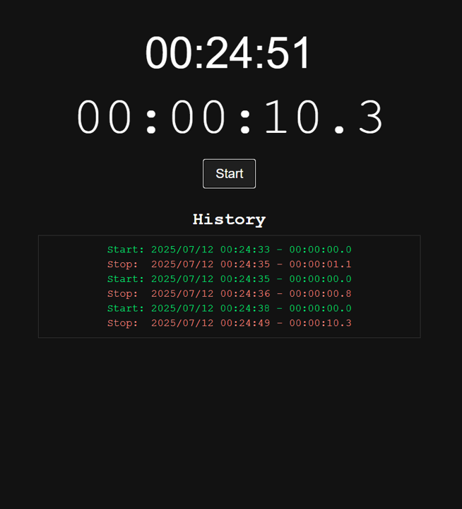

# ストップウォッチ

シンプルでスタイリッシュなストップウォッチのWebアプリケーションです。

## 主な機能

- 現在時刻の表示
- スタート/ストップが可能なストップウォッチ（スペースキーでの操作に対応）
- スタート/ストップのイベント履歴をタイムスタンプ付きで記録
- 履歴は視認性を高めるために色分け表示

## スクリーンショット

## 使い方

1. `index.html` ファイルをウェブブラウザで開きます。
2. 「Start」ボタンまたはスペースキーを押すと、ストップウォッチが開始します。
3. 「Stop」ボタンまたはスペースキーを押すと、ストップウォッチが停止します。
4. イベントの履歴が画面下部に記録されます。